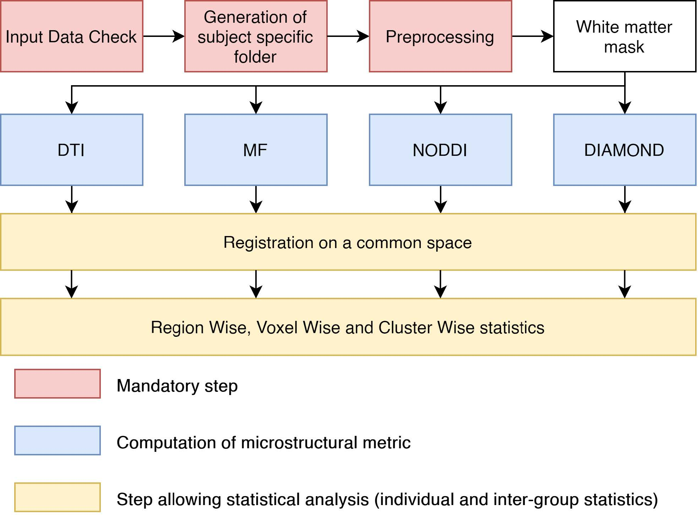

.. _elikopy-project:

========================================
Project as an easy way to manage a study
========================================

-------------------------------
Main available processing steps
-------------------------------

Using a rich set of functions, data processed with ElikoPy are firstly audited to ensure
that the image dimension match the dimension of the b-value and b-vector files along the
acquisitions parameters and index files. If successful, a dedicated storage folder for each
subject is generated. Afterward, preprocessing can be applied to correct and enhanced
the raw image. This includes, brain extraction, reslicing, Principal Component Analysis
(PCA) based denoising using the Marchenko-Pastur distribution, suppression in image
space of Gibbs ringing artifacts, estimation and correction of the susceptibility induced
field, modeling and correction of subject movements and finally, bias field correction. After
the preprocessing, a white matter mask registered on diffusion data can be obtained using
a T1 image or computed directly from diffusion data by segmenting an Anisotropic Power
(AP) map.

As seen in the figure below, four distinct algorithms for the estimation of the microstructure are
available. Subsequently, the pipeline adds the possibility to register the computed metrics
in a common space given by either one of the study subjects or by an atlas. Finally, from
there, ElikoPy can output statistical results for population studies by aligning metrics
from multiple subjects into a common space and performing region wise, voxel wise and cluster wise statistics.

  
  
----------------
Folder structure
----------------

The Elikopy toolbox follows a specific folder structure that prevents ambiguity and data
losses when dealing with a large amount of subjects. The figure below illustrates the folder tree in
ElikoPy.

.. image:: pictures/folder_structure.png
	:width: 800
	:alt: Overview of the folder structure used by the ElikoPy toolbox.
  
The first type of folder present at the root of the Elikopy project are **data** folders. These
folders contain all raw subject files belonging to the same class along with the associated
acquisition parameters and index files. Classes are used to separate subjects that have
different acquisition parameters or subjects that need to be separated from others groups of
subjects. The pipeline does not have a limitation on the number of classes.

The **subjects** folder contains a subfolder for each valid subject presents in **data** folders.
Along these subfolders, three json files are present. The subj_error.json file contains the
list of subjects with invalid raw data, The subj_list.json file contains the list of valid
subjects and the subj_type.json is a dictionary that maps each subjects subfolder to its
data class.

Each subdirectory of the **subjects** folder contains the output of every preprocessing and
processing function executed on the patient associated with the subdirectory. The output
consists of NIfTI files, log files and some others files related to the specific functions.

The **registration** folder contains diffusion metrics registered to a common space, group
wise statistics and voxel wise statistics for each registered metric.

Finally, the **static_files** folder contains files mandatory for some processing steps of
the library such as MF dictionary and Synb0-DisCo atlases.