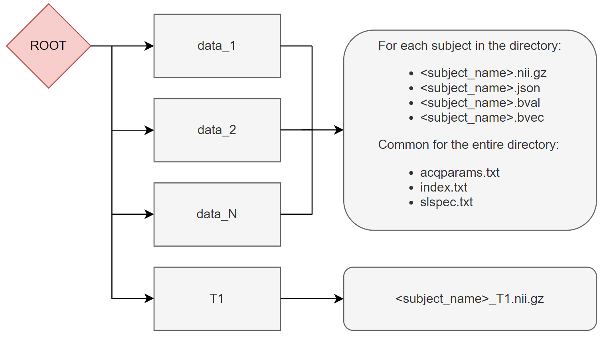

.. _elikopy-usage:

====================================
Typical usage for processing a study
====================================

On this page is presented a basic usage of the ElikoPy library. More information on all these functions are available in the detailed guide.
	
Header and initialisation
^^^^^^^^^^^^^^^^^^^^^^^^^

The first step to enable ElikoPy is to import it and initialise the ElikoPy object "*study* " specific to the current study. 
The only required argument for the constructor is the path to the root directory of the project.

.. code-block:: python
	:linenos:
	:lineno-start: 1
	
	import elikopy 
	import elikopy.utils
	
	f_path="/PROJECTS/" 
	dic_path="/PROJECTS/static_files/mf_dic/fixed_rad_dist.mat"
	
	study = elikopy.core.Elikopy(f_path)
	study.patient_list()

The root directory must have the following structure during the initialisation

The T1 structural images as well as the acqparams, index and slspec files are optional. However, if they are not available, some processing steps might be not available (this is usually specified by a note in the documentation).
These files can be generated as explained in the following links:

* acqparams.txt and index.txt : `Eddy FSL acqp <https://fsl.fmrib.ox.ac.uk/fsl/fslwiki/eddy/Faq#How_do_I_know_what_to_put_into_my_--acqp_file>`_
* slspec.txt : `Eddy FSL slspec <https://fsl.fmrib.ox.ac.uk/fsl/fslwiki/eddy/UsersGuide#A--slspec>`_

.. note::
	If you have volumes that are acquired with reverse phase encoding directions in separate niftis, instead of merging the niftis, it is possible to use the 'reverseEncoding' argument of patient_list.

	.. code-block:: python

		study.patient_list(reverseEncoding=True)

	In this case a reverseEncoding directory containing the data with reversed phase encoding direction can be added in the DATA_N folders and the merging operation will be managed automatically.

.. note::
	The BIDS format is also supported in input using the bids_path argument of patient_list

Preprocessing
^^^^^^^^^^^^^

The following code block show how to preproccess the dMRI data. By default only the brain extraction is enabled in the preprocessing but we recommend you to enable more preprocessing as described in the detailled guide (see :ref:`preprocessing-dmri`).

.. code-block:: python
	:linenos:
	:lineno-start: 8
	
	study.preproc()
	
whitematter mask
^^^^^^^^^^^^^^^^

The following code block computes a white matter mask for each subject from its T1 structural image (if available). If the T1 is not available, the mask is computed using the anisotropic power map generated from the diffusion data.

.. code-block:: python
	:linenos:
	:lineno-start: 9

	study.white_mask()
	
Microstructural metrics computation
^^^^^^^^^^^^^^^^^^^^^^^^^^^^^^^^^^^

The following code block computes microstructural metrics from the four microstructural model available in ElikoPy.

.. code-block:: python
	:linenos:
	:lineno-start: 10
	
	study.dti()
	study.noddi()
	study.diamond()
	study.fingerprinting()
	
Statistical Analysis
^^^^^^^^^^^^^^^^^^^^

In the following code block, fractional anisotropy (FA) from DTI along other additional metrics are registered into a common space. The registration is computed using the FA and the mathematical transformation is applied to other metrics.

Afterwards, the randomise_all function performs group wise statistic for the defined metrics along extraction of individual region wise value for each subject into csv files. 

.. code-block:: python
	:linenos:
	:lineno-start: 14
	
	grp1=[1]
	grp2=[2]
	
	

	study.regall_FA(grp1=grp1,grp2=grp2)
	
	additional_metrics={'_noddi_odi':'noddi','_mf_fvf_tot':'mf','_diamond_kappa':'diamond'}
	study.regall(grp1=grp1,grp2=grp2, metrics_dic=additional_metrics)
	
	metrics={'dti':'FA','_noddi_odi':'noddi','_mf_fvf_tot':'mf','_diamond_kappa':'diamond'}
	study.randomise_all(metrics_dic=metrics)
	
Data Exportation
^^^^^^^^^^^^^^^^

The export function is used to "revert" the folder structure, instead of using a subject specific folder tree, data are exported into a metric specific folder tree. In this example, only metrics computed from the dti model are exported. 

.. code-block:: python
	:linenos:
	:lineno-start: 22
	
	study.export(raw=False, preprocessing=False, dti=True, 
		noddi=False, diamond=False, mf=False, wm_mask=False, report=True)
		
		
.. note::
	If you wish to learn more about the library and its validation, we recommend you to read the detailled guide and play around with the library.
	
	
	
Other parameters commonly available
^^^^^^^^^^^^^^^^^^^^^^^^^^^^^^^^^^^

The ElikoPy library has been made compatible with the slurm scheduler commonly present on HPC clusters. The use of the slurm scheduler can be controlled with the **slurm** parameters.

Associated options are:

* **slurm** – Whether to use the Slurm Workload Manager or not (for computer clusters). default=value_during_init
* **slurm_email** – If not None, Topup will use additionnal parameters based on the supplied config file located at <topupConfig>. default=None Email adress to send notification if a task fails. default=None
* **slurm_timeout** - Replace the default slurm timeout used in the ElikoPy function by a custom timeout.
* **slurm_mem** - Replace the default amount of ram allocated to the slurm task by a custom amount of ram.
* **cpus** – Replace the default number of slurm cpus by a custom number of cpus.

The slurm option and slurm_email option can be globally define during the initialisation of the study object.

When processing a study, the processing for some subjects could fail for various reasons. The ElikoPy library provides two parameters destined to limit the amount of processing necessary to recover from these failures.

* **patient_list_m** – Define a subset of subjects to process instead of all the available subjects. example : [‘patientID1’,’patientID2’,’patientID3’]. default=None
* **starting_state** – Manually set which step of the function to start from. default=None

