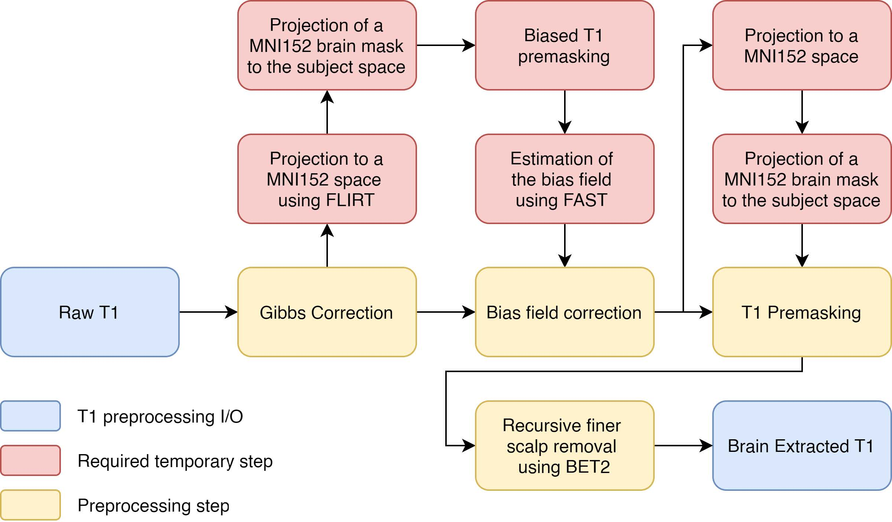
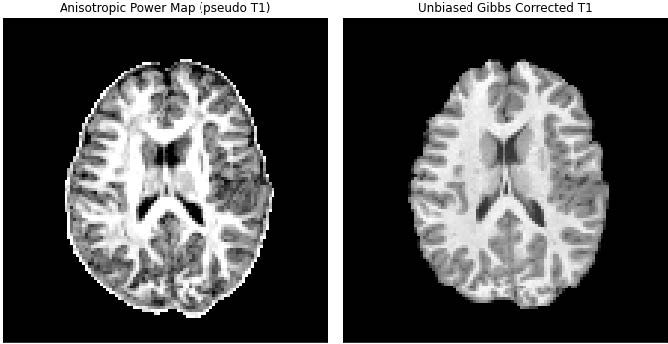

.. _preprocessing-T1:

================
T1 Preprocessing
================

Providing a white matter mask is a useful step to accelerate microstructural features
computation and more easily do tractography. The white_mask function of the ElikoPy
library has been elaborated to perform this important step.

On the one hand, when a T1 image is available, a white matter mask can be computed
from this data. Therefore, the T1 image is first preprocessed then segmented. Finally the
segmented white matter mask is projected into the space of the preprocessed diffusion
image.

On the other hand, when no T1 images are available, the white matter mask is directly
computed from a segmentation of the diffusion data using Anisotropic Power (AP) map. In this case, no registrations are necessary.

