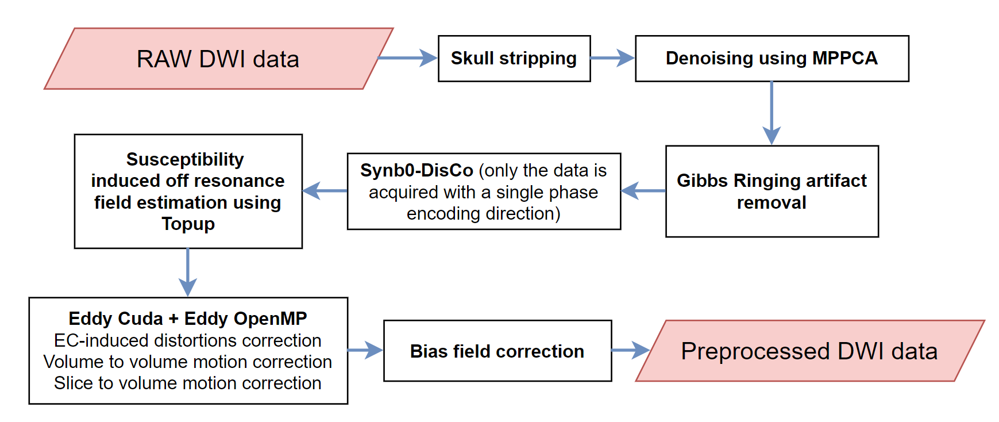
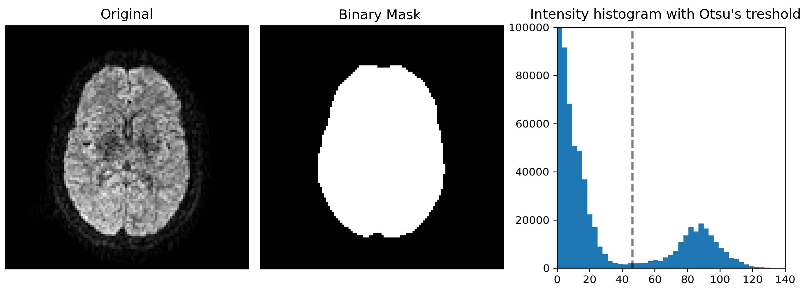
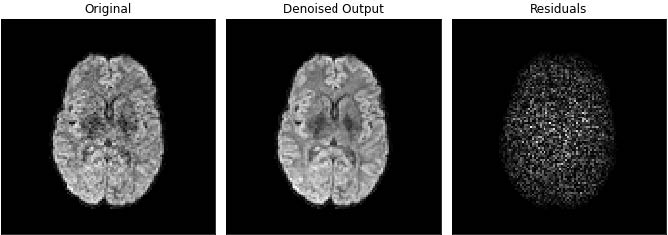
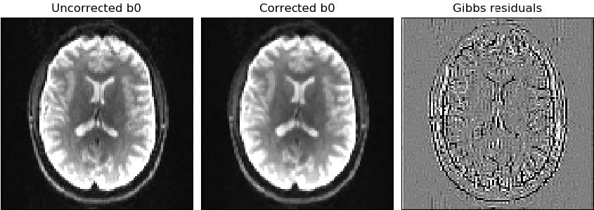

.. _preprocessing-dmri:

========================================
Preprocessing of diffusion images
========================================

The preprocessing stage aims at correcting the non idealities affecting the diffusion data
before computing the diffusion metrics. With the exception of skull stripping, all processing steps are optional and can be applied at the
user discretion.

To preproccess the dMRI data, the following line of code is used. However, this results in the default preprocessing that encompass only the skull striping step. To perform more advanced preprocessing, we need to dive into the arguments of the preproc function.

.. code-block:: python

	study.preproc()

The arguments of the preproc function are given in the API.
In this page, only the main arguments are explained in order to grasp the key aspects of preprocessing using ElikoPy.

-------
Reslice
-------

Description
^^^^^^^^^^^

If the raw data is not in its ’native’ resolution, a reslicing process might be required. Usually, the
MRI scanner performs automatic interpolation on the data in order to beautify the data
since clinicians usually have a preference for high resolution images. However, the intrinsic
resolution is not augmented by this interpolation. While somewhat useful to clinicians, the
interpolation is usually not desirable for research. Using it means more computation time
and uncorrelated noise becoming correlated which reduces the performances of MPPCA
denoising algorithms. Moreover, interpolation is not desirable when performing Gibbs
ringing correction. Reslicing is therefore a way to mitigate the
effect of mandatory interpolation during the acquisition.

Related parameters
^^^^^^^^^^^^^^^^^^
The reslicing step during the preprocessing can be activated using the reslice argument.

* **reslice** - If true, data will be resliced with a new voxel resolution of 2*2*2. default=False
* **reslice_addSlice** - If true, an additional empty slice will be added to each volume (might be useful for motion correction if one slice is dropped during the acquisition and the user still wants to perform easily the slice-to-volume motion correction). default=False

.. code-block:: python

	study.preproc(reslice=True,reslice_addSlice=False)
	
	

----------------
Brain Extraction
----------------

Description
^^^^^^^^^^^

The brain is extracted from the skull and other tissues surrounding the brain to increase
the processing efficiency of subsequent steps and it is generally required before using
other image processing algorithms. At the end of the preprocessing, a final brain mask readjusted in regard of all the applied
preprocessing steps is also provided as output.

The mask is computed using median_otsu from DiPy.

Related parameters
^^^^^^^^^^^^^^^^^^

The brain extraction is the only mandatory step and cannot be disabled. However, it is possible to change the parameters of the method

* **bet_median_radius** - Radius (in voxels) of the applied median filter during brain extraction. default=2
* **bet_numpass** - Number of pass of the median filter during brain extraction. default=1
* **bet_dilate** - Number of iterations for binary dilation during brain extraction. default=2

.. code-block:: python

	study.preproc(bet_median_radius=2, bet_numpass=2, bet_dilate=2)

---------------
MPPCA Denoising
---------------

Description
^^^^^^^^^^^

To reduce Rician noise typically found in MR images, the input images are denoised
using the Marchenko-Pastur PCA technique as implemented in DiPy. Since the noise in
diffusion data is spatially dependent in the case of multichannel receive coils, Principal component analysis of Marchenko-Pastur (MPPCA) noise-only
distribution provides an accurate and fast method of noise evaluation and reduction. This methods has been chosen since it is a fast denoising algorithm
that does not blur the image or create artifact.

Related parameters
^^^^^^^^^^^^^^^^^^

The denoising step during the preprocessing can be activated using the denoising argument.

.. code-block:: python

	study.preproc(denoising=True)

------------------------
Gibbs Ringing Correction
------------------------

Description
^^^^^^^^^^^

In general, in the context of diffusion-weighted imaging, derived diffusion-based estimates
are affected by Gibbs oscillations. To correct for this,
gibbs_removal from DiPy is used. This algorithm models the truncation of k-space as a
convolution with a sinc-function in the image space. The severity of ringing artifacts thus
depends on how the sampling of the sinc function occurs. The gibbs_removal function
reinterpolate the image based on local, subvoxel-shifts to sample the ringing pattern at
the zero-crossings of the oscillating sinc-function.

p changes in intensity.

Related parameters
^^^^^^^^^^^^^^^^^^

The Gibbs removal can be enabled using the gibbs argument.

.. code-block:: python

	study.preproc(gibbs=True)

Unless the data suffers heavily from Gibbs ringing artifacts, we do not advise to use the gibbs ringing removal step as it might blurr out small microstructural features.

-------------------------------
Susceptibility field estimation
-------------------------------

Description
^^^^^^^^^^^

Susceptibility distortions are created by differences in magnetic susceptibility near junctions of tissues. The susceptibility off resonance field is estimated using Topup from FSL. To do so,
Topup needs data acquired with multiple phase encoding directions (at least 2). If only a single phase encoding direction is available, ElikoPy uses instead a generated synthetic volume based on a T1 structural image using Synb0-DisCo.
This step only allows to **estimate** the susceptibility distortions, they are corrected at the same time as the Eddy current distortions in the Eddy step below.

Related parameters
^^^^^^^^^^^^^^^^^^

The susceptibility field estimation can be enabled using the topup argument.

* **topup** -  true, Topup will estimate the susceptibility induced distortions. These distortions are corrected at the same time as EC-induced distortions if eddy=True. In the absence of images acquired with a reverse phase encoding direction, a T1 structural image is required. default=False
* **topupConfig** – If not None, Topup will use additionnal parameters based on the supplied config file located at <topupConfig>. default=None
* **forceSynb0DisCo** - If true, Topup will always estimate the susceptibility field using the T1 structural image. default=False

.. code-block:: python

	study.preproc(topup=True)

.. note::
    If Topup is used, ElikoPy needs the acqparam and index files when generating the patient list : :ref:`elikopy-usage`

.. note::
    If topup is enabled for data with a single phase encoding direction, a T1 structural image has to be provided when generating the patient list : :ref:`elikopy-usage`

--------------------------
Eddy and motion correction
--------------------------

Description
^^^^^^^^^^^

Motion, susceptibility and Eddy current induced distortions are artifacts with different origins but a similar effect i.e the displacement and deformation of the brain. They can therefore be jointly corrected. This is achieved using FSL Eddy. The susceptibility distortions are only corrected if they have been estimated during the topup step. By default only the inter-volume (volume-to-volume) motion is corrected but it is also possible to correct for intra-volume (slice-to-volume) motion.

Related parameters
^^^^^^^^^^^^^^^^^^

The motion and distortion correction can be activated using the eddy argument. The number of iteration for the motion correction algorithm can also be changed.

.. code-block:: python

	study.preproc(eddy=True, niter=5)

In cases with large motion, inter-volume motion correction might not be sufficient and intra-volume correction is required. This option can be enabled using the s2v argument.
The s2v input is a list of 4 parameters : [mporder,s2v_niter,s2v_lambda,s2v_interp]. The slice-to-volume motion correction is performed if mporder>0. These parameters are explained in depth in the `Eddy FSL documentation <https://fsl.fmrib.ox.ac.uk/fsl/fslwiki/eddy/UsersGuide>`_. If N describes the number of excitations in a volume, setting mporder to N/4 while letting the other 3 parameters to their default values should provide good results in most situations. The slice-to-volume motion correction is currently only possible with cuda enabled.

Using the framework of Eddy FSL, it is also possible to replace outlier slices. This is done with the olrep argument which is a list of 4 parameters : [repol,ol_nstd,ol_nvox,ol_type]. The outlier replacement is performed if repol==True. These parameters are explained in depth in the `Eddy FSL documentation <https://fsl.fmrib.ox.ac.uk/fsl/fslwiki/eddy/UsersGuide>`_.

.. code-block:: python

	study.preproc(eddy=True, niter=5, s2v=[6,5,1,'trilinear'], cuda=True, cuda_name='eddy_cuda10.1', olrep=[True, 4, 250, 'sw'])

.. note::
    If Eddy FSL is used, ElikoPy needs the acqparam and index files when generating the patient list :ref:`elikopy-usage`.

.. note::
    If slice-to-volume motion correction is enabled, ElikoPy needs the slspec file when generating the patient list :ref:`elikopy-usage`.

---------------------
Bias Field Correction
---------------------

Description
^^^^^^^^^^^

Variability of the signal in tissues of the same type can affect microstructural metrics computation and brain segmentation algorithms.
This can be corrected using the N4 Bias Field Correction algorithm.

Related parameters
^^^^^^^^^^^^^^^^^^

The bias field correction can be activated using the biasfield argument. It is also possible to modify the parameters of the correction method.

* **biasfield_bsplineFitting** - Define the initial mesh resolution in mm and the bspline order of the biasfield correction tool.
* **biasfield_convergence** - Define the maximum number of iteration and the convergences threshold of the biasfield correction tool.

.. code-block:: python

	study.preproc(biasfield=True, biasfield_bsplineFitting=[100,3], biasfield_convergence=[1000,0.001])

------
Report
------

By default, the preproc function outputs a quality report that contains quality control features for the processing. This can be disabled if needed.

.. code-block:: python

	study.preproc(report=False)

